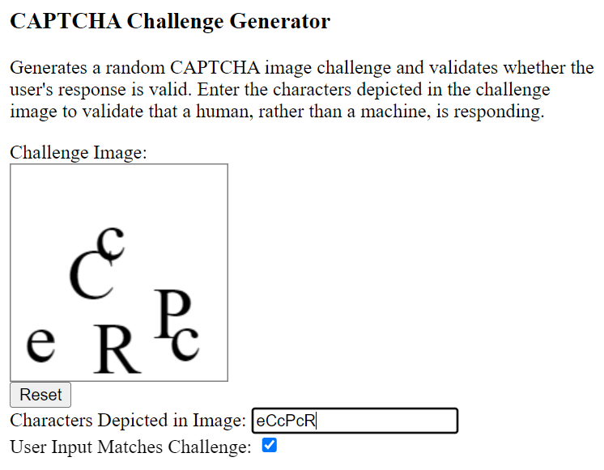

CAPTCHA Generator
=================

The program in this repository generates a CAPTCHA
("Completely Automated Public Turing test to tell Computers and Humans Apart")
image challenge and validates the user input to see if it matches.

Note that this code, as currently written, is less than ideal
on several fronts, not least because the distortion of the image 
tends to be fairly trivial, and also the correct response
to the challenge has to be visible in client-side code.
But it may nonetheless be helpful against relatively automation attacks.